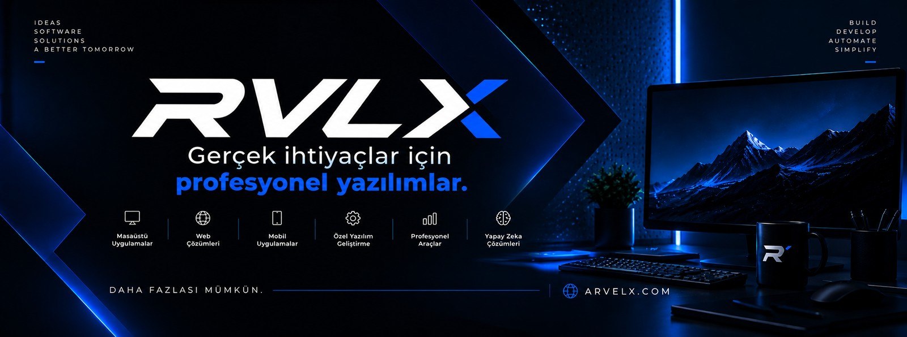
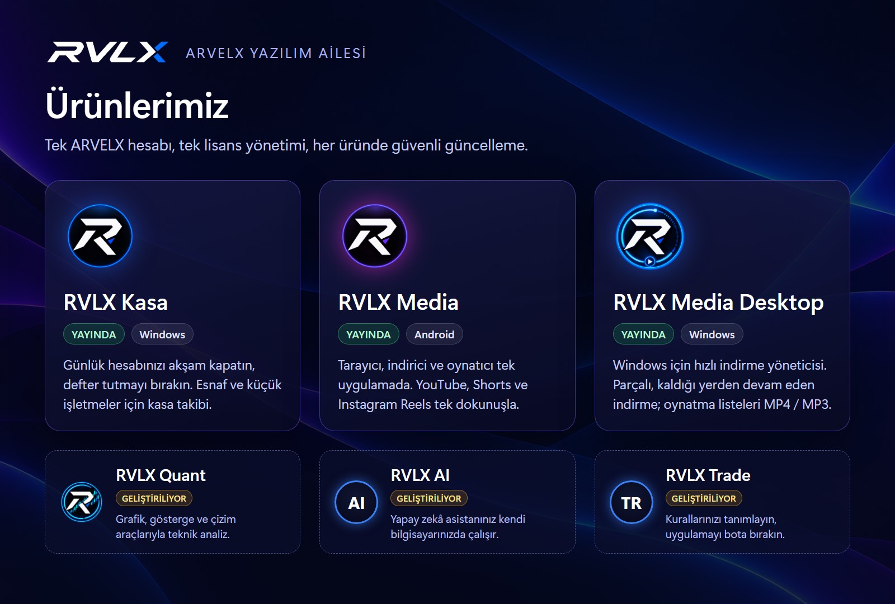

<div align="center">

<a href="https://www.arvelx.com"></a>

# ARVELX

**İşinizi kolaylaştıran profesyonel yazılımlar.**
Masaüstü, mobil ve web için RVLX ürün ailesi — tek hesap, tek lisans, güvenli güncelleme.

<a href="https://www.arvelx.com"></a> <a href="https://www.arvelx.com/urunler"></a> <a href="https://www.arvelx.com/fiyatlandirma"></a> <a href="https://github.com/tlgtrzi-code/arvelx.com/releases"></a>

</div>

---

<div align="center">

</div>

## 🚀 Yayındaki ürünler

<table>
<tr>
<td width="120" align="center"></td>
<td>

### RVLX Kasa
**Günlük hesabınızı akşam kapatın, defter tutmayı bırakın.**
Küçük işletmeler ve esnaf için kasa takibi. Gelir gider girin, gün sonunda kapanışı alın. Muhasebe bilgisi gerekmez.

- 🧾 **Kasa hesapları** — birden fazla kasa tanımlayın, her birinin durumunu ayrı ayrı görün.
- ➕ **Gelir gider takibi** — girişleri tek ekrandan yapın, sonradan düzenleyin.
- 🌙 **Günlük kapanış** — gün sonunda kasanın ne kadar olması gerektiğini ve sayımla farkını gösterir.

 

**[⬇️ İndir ve incele](https://www.arvelx.com/urunler/nexus-kasa)**

</td>
</tr>
<tr>
<td width="120" align="center"></td>
<td>

### RVLX Media
**Tarayıcı, indirici ve oynatıcı tek uygulamada.**
Android için RVLX Browser. İzlediğiniz YouTube videosunu, Shorts'u ya da Instagram Reels'i tek dokunuşla indirin; RVLX Player ile uygulamadan çıkmadan izleyin.

- ▶️ **YouTube videoları ve Shorts** — video MP4, isterseniz yalnız ses MP3 olarak kaydedilir.
- 📸 **Instagram Reels ve gönderileri** — herkese açık içerikte aynı düğmeyle.
- 📥 **RVLX İndir** — kuyruk, arka planda indirme ve bitince bildirim.
- 🎬 **RVLX Player** — indirdikleriniz uygulama içinde kitaplık olarak listelenir.
- 🛡️ **RVLX Browser** — izleyici ve reklam engelleme varsayılan olarak açık.
- 🎁 **Ücretsiz başlayın** — günde 3 indirme; Pro lisansta sınır yok.

 

**[⬇️ İndir ve incele](https://www.arvelx.com/urunler/rvlx-media)**

</td>
</tr>
<tr>
<td width="120" align="center"></td>
<td>

### RVLX Media Desktop
**Windows için hızlı indirme yöneticisi ve video indirici.**
Dosyaları parçalara bölerek hızlı indirir, bağlantı koparsa kaldığı yerden sürdürür. YouTube videolarını, oynatma listelerini ve Mix'leri MP4 ya da MP3 olarak indirir.

- 📋 **Oynatma listeleri ve Mix** — tek bağlantıyla listenin tamamı kuyruğa girer.
- ⚡ **Hızlı, kaldığı yerden devam eden indirme** — parçalı indirme, kuyruklar ve zamanlama.
- 🧩 **Tarayıcı eklentisi** — Chrome, Edge ve Firefox'taki indirmeleri uygulamaya gönderir (mağaza onayı bekleniyor).
- 🗂️ **Kendiliğinden klasörleme** — her liste kendi klasörüne iner.
- 🔐 **ARVELX hesabınızla açılır** — 3 gün ücretsiz deneme.

 

**[⬇️ İndir ve incele](https://www.arvelx.com/urunler/RVLX-Media-Desktop)**

</td>
</tr>
</table>

## 🛠️ Geliştirilen ürünler

<table>
<tr>
<td align="center" width="33%"><br><b>RVLX Quant</b><br><sub>Grafik, gösterge ve çizim araçlarıyla teknik analiz.</sub><br><a href="https://www.arvelx.com/urunler/analiz-platformu">Ürün sayfası →</a></td>
<td align="center" width="33%"><h3>🤖</h3><b>RVLX AI</b><br><sub>Yapay zekâ asistanınız kendi bilgisayarınızda çalışır.</sub><br><a href="https://www.arvelx.com/urunler/nexus-ai">Ürün sayfası →</a></td>
<td align="center" width="33%"><h3>📈</h3><b>RVLX Trade</b><br><sub>Kurallarınızı tanımlayın, uygulamayı bota bırakın.</sub><br><a href="https://www.arvelx.com/urunler/oto-alim-satim-botu">Ürün sayfası →</a></td>
</tr>
</table>

## 💎 Neden ARVELX?

| Özellik | Ne sağlar |
|---|---|
| 👤 **Tek hesap** | Tüm ürünlere aynı arvelx.com hesabıyla girersiniz; lisanslarınızı, cihazlarınızı ve siparişlerinizi tek panelden yönetirsiniz. |
| 🔑 **Şeffaf lisans** | Lisans, satın aldığınız cihaza bağlanır; kısa bir süre internetsiz de çalışmaya devam eder. |
| 🔄 **Uygulama içi güncelleme** | Yeni sürümler uygulamanın içinden bulunur; RVLX Media ve RVLX Media Desktop indirdikleri dosyayı kurmadan önce yayınlanan **SHA-256** ile doğrular. |
| 🇹🇷 **Türkçe ve yerel** | Arayüz, destek ve belgeler Türkçe. |

## 📦 İndirme ve doğrulama

1. Ürün sayfasından ya da [Sürümler](https://github.com/tlgtrzi-code/arvelx.com/releases) bölümünden ilgili dosyayı indirin.
2. Her sürümle birlikte gelen `SHA256SUMS.txt` ile dosyayı doğrulayın:

   ```powershell
   # Windows (PowerShell)
   Get-FileHash .\RVLX_Kasa_Setup.exe -Algorithm SHA256
   ```

   Çıkan değer `SHA256SUMS.txt` içindekiyle aynı olmalıdır.
3. Kurun. Uygulama sonraki sürümleri kendisi bulur; ayarlarınız ve verileriniz korunur.

| Ürün | Dosya | Sistem |
|---|---|---|
| RVLX Kasa | `RVLX_Kasa_Setup.exe` | Windows 10 / 11 |
| RVLX Media | `rvlx-media-<sürüm>-play-release.apk` | Android 9 ve üstü (Play Store dışı kurulum) |
| RVLX Media Desktop | `RVLX_Media_Desktop_Setup_<sürüm>.exe` | Windows 10 / 11, 64 bit |

## ℹ️ Bu depo hakkında

Bu depo ARVELX ürünlerinin **genel dağıtım** noktasıdır: kurulum dosyaları, APK'lar, sürüm notları ve doğrulama değerleri burada, **Releases** bölümünde yayınlanır. Kaynak kod burada bulunmaz; özel olarak ayrı bir yerde tutulur.

## 💬 İletişim

Sorularınız ve destek için: **[arvelx.com/iletisim](https://www.arvelx.com/iletisim)**

<div align="center">
<br>
<a href="https://www.arvelx.com"></a>
<br><sub>© ARVELX · RVLX ürün ailesi</sub>
</div>
